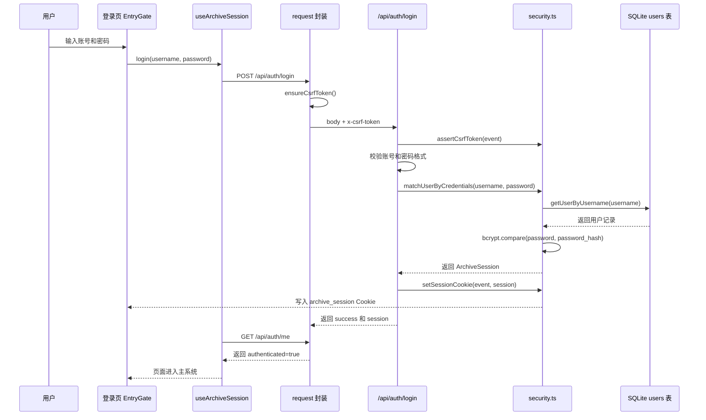
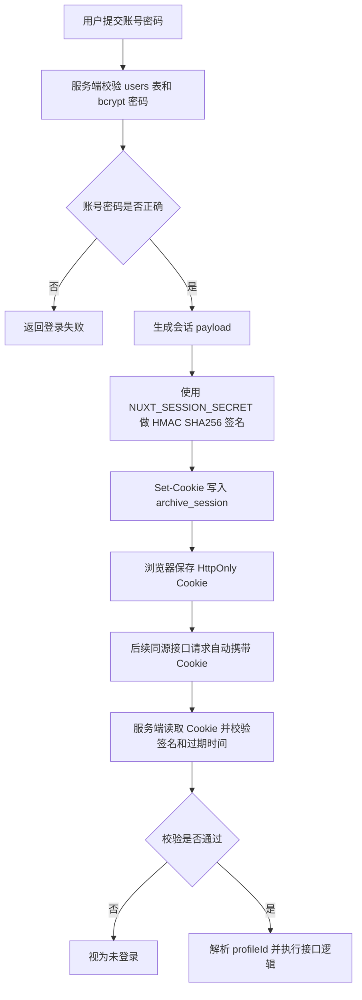
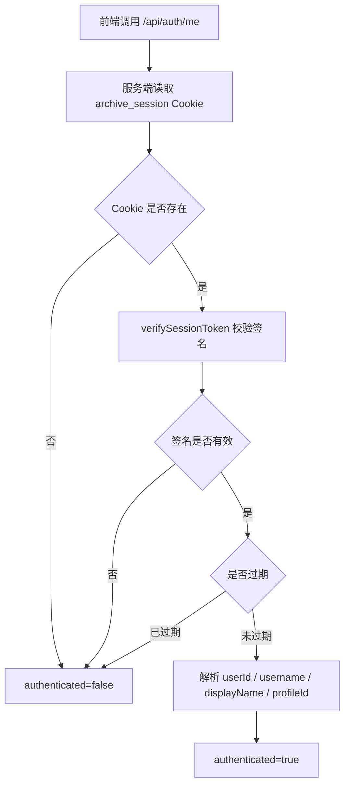
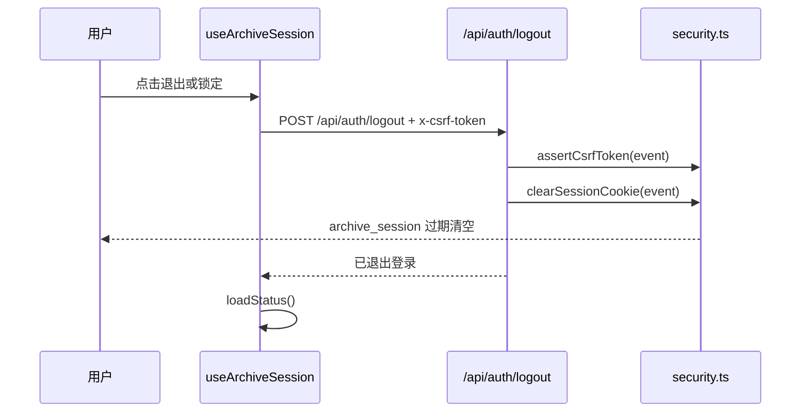
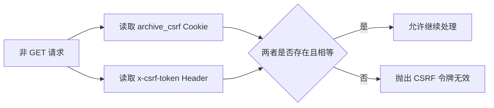
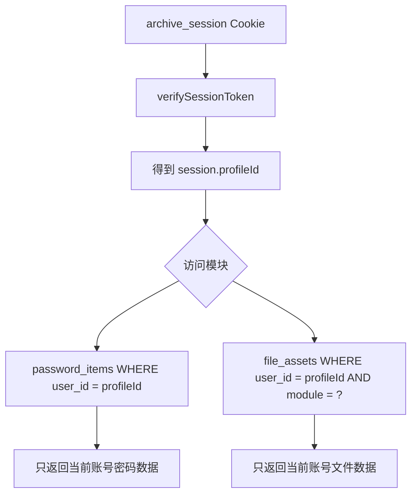
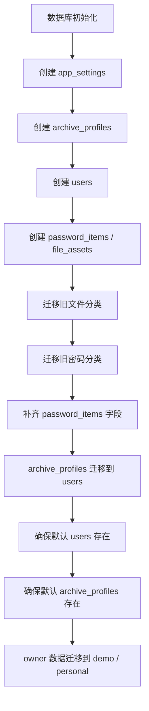

# 用户与登录管理流程

本文档说明个人档案 Archive 当前的用户来源、登录流程、会话机制、CSRF 防护、业务接口鉴权和数据隔离方式。文档对应当前 Nuxt 4 + SQLite 实现。

## 一、整体结论

当前项目使用“SQLite 用户表 + bcrypt 密码哈希 + HMAC 签名 Cookie 会话 + CSRF 防护 + profileId 数据隔离”的登录方案。

核心特点：

- 用户账号存储在 SQLite `users` 表。
- 密码使用 bcrypt 哈希保存，不保存明文密码。
- 登录成功后服务端写入 `archive_session` Cookie。
- `archive_session` 是签名令牌，不是服务端数据库会话。
- 业务接口通过 Cookie 中的登录态获取当前用户，不信任前端传入的用户身份。
- 密码、文档、简历、图片、证件、学习资料均通过当前用户的 `profileId` 做数据隔离。

## 二、相关文件

| 文件 | 作用 |
| --- | --- |
| `src/composables/useArchiveSession.ts` | 前端登录状态、登录、退出和状态刷新 |
| `src/utils/request.ts` | 前端统一请求封装，自动处理 CSRF |
| `server/api/auth/login.post.ts` | 账号密码登录接口 |
| `server/api/auth/me.get.ts` | 查询当前登录状态 |
| `server/api/auth/logout.post.ts` | 退出登录接口 |
| `server/api/auth/unlock.post.ts` | 兼容旧路径的登录接口 |
| `server/api/auth/lock.post.ts` | 兼容旧路径的退出接口 |
| `server/api/security/csrf.get.ts` | 创建或返回 CSRF Token |
| `server/utils/security.ts` | 会话签名、Cookie、CSRF、密码校验和鉴权工具 |
| `server/utils/database.ts` | 用户表、默认用户、历史数据迁移和业务数据查询 |

## 三、用户模型

用户存储在 SQLite `users` 表。

```sql
CREATE TABLE IF NOT EXISTS users (
  id TEXT PRIMARY KEY,
  username TEXT UNIQUE NOT NULL,
  display_name TEXT NOT NULL,
  password_hash TEXT NOT NULL,
  status TEXT NOT NULL DEFAULT 'active',
  created_at TEXT NOT NULL DEFAULT CURRENT_TIMESTAMP,
  updated_at TEXT NOT NULL DEFAULT CURRENT_TIMESTAMP
);
```

字段含义：

| 字段 | 含义 |
| --- | --- |
| `id` | 用户标识，同时作为当前系统的 `profileId` |
| `username` | 登录账号，唯一 |
| `display_name` | 页面展示名称 |
| `password_hash` | bcrypt 哈希后的密码 |
| `status` | 用户状态，当前登录只允许 `active` |
| `created_at` | 创建时间 |
| `updated_at` | 更新时间 |

## 四、默认账号

数据库初始化时会自动保证两个默认用户存在。

| 用户 id | 登录账号 | 显示名称 | 默认密码来源 | 未配置时默认值 |
| --- | --- | --- | --- | --- |
| `personal` | `xinjie` | `个人档案` | `NUXT_PERSONAL_ACCOUNT_PASSWORD` 或 `NUXT_PERSONAL_ARCHIVE_PASSWORD` | `xinjie123` |
| `demo` | `demo` | `演示账号` | `NUXT_DEMO_ACCOUNT_PASSWORD` 或 `NUXT_DEMO_ARCHIVE_PASSWORD` | `123456` |

密码写入数据库前会通过 `bcrypt.hashSync(password, 12)` 哈希。

注意：

- 默认密码只适合本地开发或演示。
- 生产环境必须通过 `.env` 覆盖默认密码。
- 如果环境变量存在，启动初始化时会更新对应用户的密码哈希。

## 五、登录流程

登录入口：

- 前端：`useArchiveSession().login(username, password)`
- 接口：`POST /api/auth/login`

流程图：



接口逻辑：

1. 校验 CSRF Token。
2. 读取请求体中的 `username` 和 `password`。
3. 校验账号不能为空。
4. 校验密码长度至少 6 位。
5. 查询 `users` 表。
6. 判断用户是否存在且 `status === 'active'`。
7. 使用 bcrypt 对比明文密码和 `password_hash`。
8. 生成签名会话令牌。
9. 写入 `archive_session` Cookie。
10. 返回登录成功响应。

## 六、会话机制

会话 Cookie 名称：

```text
archive_session
```

会话有效期：

```text
8 小时
```

会话内容：

```ts
interface ArchiveSession {
  userId: string;
  username: string;
  displayName: string;
  profileId: string;
  profileName: string;
}
```

当前实现中：

- `userId` 是用户表 `users.id`。
- `profileId` 默认等于 `userId`。
- `profileName` 默认等于 `displayName`。

Cookie 设置：

```ts
setCookie(event, 'archive_session', token, {
  httpOnly: true,
  maxAge: 60 * 60 * 8,
  path: '/',
  sameSite: 'strict',
  secure: process.env.NODE_ENV === 'production'
});
```

会话令牌格式：

```text
base64url(payload).base64url(signature)
```

签名方式：

```text
HMAC SHA256
```

签名密钥：

```text
NUXT_SESSION_SECRET
```

生产环境要求：

- `NUXT_SESSION_SECRET` 必须存在。
- 长度必须至少 32 个字符。
- 如果生产环境缺失该变量，服务端会抛出错误。

开发环境行为：

- 如果未配置 `NUXT_SESSION_SECRET`，服务会生成一个临时随机密钥。
- 服务重启后旧 Cookie 会失效。

## 七、为什么当前没有使用 JWT

当前项目不是完全没有使用 token，而是没有使用 JWT 标准格式。项目使用的是自定义的 HMAC 签名 Cookie 令牌：

```text
base64url(payload).base64url(signature)
```

它和 JWT 的相同点：

| 对比项 | 当前签名 Cookie | JWT |
| --- | --- | --- |
| 是否包含用户身份 | 是 | 是 |
| 是否包含过期时间 | 是 | 是 |
| 是否通过密钥签名防篡改 | 是 | 是 |
| 是否可以无状态校验 | 是 | 是 |

它和 JWT 的区别：

| 对比项 | 当前签名 Cookie | JWT |
| --- | --- | --- |
| token 格式 | 自定义两段式 | 标准三段式 `header.payload.signature` |
| 标准化生态 | 项目内部使用 | 通用标准，第三方工具支持更多 |
| 主要适用场景 | 单体 Web 应用 | 多服务、开放 API、移动端、第三方集成 |
| 浏览器保存方式 | `HttpOnly Cookie` | 可放 Cookie，也常见于 Authorization Header |

当前没有使用 JWT 的原因：

1. 当前是 Nuxt 单体 Web 应用，前端页面和服务端接口同源，不需要把身份令牌传递给多个后端服务。
2. 项目数据存储在本地 SQLite，用户体系也由当前服务直接管理，不需要第三方系统识别 token。
3. `HttpOnly Cookie` 更适合网页登录，前端脚本不能直接读取登录令牌，降低 XSS 后 token 被读取的风险。
4. 当前签名 Cookie 已经满足“身份载荷、过期时间、防篡改、无状态校验”的核心需求。

适合考虑 JWT 的场景：

- 增加移动端 App 登录。
- 提供开放 API 给第三方系统调用。
- 前后端完全分离并跨域部署。
- 多个后端服务需要共享登录态。
- 接入 OAuth、OIDC、SSO 等标准认证体系。

## 八、HttpOnly 签名 Cookie 是否是标准流程

当前流程属于常见的 Web 登录方案，核心思想是“服务端签名、浏览器保存、请求自动携带、服务端校验”。它不是 JWT 那样的标准 token 格式，但属于标准 Cookie 机制上的常见工程实现。

几种常见方案对比：

| 方案 | 标准化程度 | 当前项目是否使用 | 说明 |
| --- | --- | --- | --- |
| 服务端 Session ID Cookie | 传统 Web 标准做法 | 否 | Cookie 只保存 sessionId，真实会话存在服务端 |
| JWT | 标准 token 格式 | 否 | 适合多端、多服务、开放接口 |
| HMAC 签名 Cookie | 常见工程方案 | 是 | Cookie 保存签名后的身份载荷，服务端无状态校验 |
| OAuth / OIDC | 第三方登录标准 | 否 | 适合第三方授权登录和统一身份认证 |

当前实现的标准化流程：



这个流程的关键点：

- 登录令牌由服务端生成，客户端不能自行伪造。
- `archive_session` 设置为 `httpOnly`，前端 JavaScript 不能通过 `document.cookie` 读取。
- Cookie 每次请求是否携带由浏览器根据 Cookie 标准判断，不需要前端手动拼接。
- 服务端每次只信任自己校验过签名的 Cookie，不信任前端传入的用户身份。

## 九、后端如何获取浏览器里的 Cookie

Cookie 虽然保存在浏览器中，但浏览器发起符合条件的请求时，会自动把 Cookie 放入 HTTP 请求头。后端不是主动访问浏览器，而是从当前请求的 `Cookie` 请求头中解析。

浏览器实际发送请求时，请求头类似：

```http
POST /api/passwords HTTP/1.1
Host: 127.0.0.1:3000
Cookie: archive_session=xxxx.yyyy; archive_csrf=zzzz
x-csrf-token: zzzz
```

当前服务端读取方式：

```ts
const session = verifySessionToken(getCookie(event, 'archive_session'));
```

含义拆解：

1. `getCookie(event, 'archive_session')` 从 HTTP 请求头的 `Cookie` 字段中取出 `archive_session`。
2. `verifySessionToken(...)` 校验 token 签名是否正确。
3. 校验 token 是否过期。
4. 校验通过后得到 `userId`、`username`、`displayName`、`profileId`、`profileName`。

`HttpOnly` 的准确含义：

| 能力 | 是否允许 |
| --- | --- |
| 前端 JavaScript 读取 `archive_session` | 不允许 |
| 浏览器请求同源接口时自动携带 `archive_session` | 允许 |
| 后端从请求头读取 `archive_session` | 允许 |

所以 `HttpOnly` 不是让后端读不到 Cookie，而是让前端脚本读不到 Cookie。

## 十、浏览器为什么会自动携带 Cookie

这是浏览器内置的 Cookie 标准行为。只要服务端通过 `Set-Cookie` 响应头写入 Cookie，浏览器后续请求匹配的地址时，就会自动把 Cookie 放进 `Cookie` 请求头。

当前项目写入 Cookie 的关键配置：

```ts
setCookie(event, 'archive_session', token, {
  httpOnly: true,
  maxAge: 60 * 60 * 8,
  path: '/',
  sameSite: 'strict',
  secure: process.env.NODE_ENV === 'production'
});
```

这些配置决定浏览器什么时候自动携带 Cookie：

| 配置 | 当前值 | 影响 |
| --- | --- | --- |
| `path` | `/` | 当前站点下所有路径都会匹配，例如 `/api/auth/me`、`/api/passwords` |
| `httpOnly` | `true` | 前端脚本不能读取，但请求仍会自动携带 |
| `sameSite` | `strict` | 只有同站请求才会携带，跨站请求通常不携带 |
| `secure` | 生产环境为 `true` | 生产环境只在 HTTPS 请求中携带 |
| `maxAge` | 8 小时 | 过期后浏览器不再携带 |

浏览器自动携带 Cookie 必须满足：

1. 请求域名匹配 Cookie 所属域名。
2. 请求路径匹配 Cookie 的 `path`。
3. Cookie 没有过期。
4. `sameSite` 规则允许当前请求携带。
5. 如果 Cookie 设置了 `secure`，请求必须是 HTTPS。

本地开发示例：

```text
页面地址：http://127.0.0.1:3000
接口地址：http://127.0.0.1:3000/api/passwords
```

这种情况下协议、域名、端口都一致，路径也匹配 `/`，所以浏览器会自动携带 `archive_session`。

容易误解的情况：

```text
Cookie 写入地址：http://127.0.0.1:3000
接口请求地址：http://localhost:3000/api/passwords
```

这种情况下 `127.0.0.1` 和 `localhost` 对浏览器来说不是同一个主机，Cookie 不会自动携带。

如果后续改成前后端跨域部署，前端请求需要显式允许携带凭证：

```ts
fetch('/api/example', {
  credentials: 'include'
});
```

后端也需要配合 CORS：

```http
Access-Control-Allow-Credentials: true
Access-Control-Allow-Origin: 指定前端域名
```

当前项目是 Nuxt 同源应用，不需要额外配置 `credentials` 和跨域 CORS。

## 十一、登录状态查询

前端通过以下方法刷新当前登录态：

```ts
useArchiveSession().loadStatus()
```

对应接口：

```text
GET /api/auth/me
```

状态查询流程：



返回数据结构：

```ts
{
  hasPassword: boolean;
  authenticated: boolean;
  userId: string | null;
  username: string | null;
  displayName: string | null;
  profileId: string | null;
  profileName: string | null;
}
```

## 十二、退出登录流程

退出入口：

- 前端：`useArchiveSession().lock()`
- 接口：`POST /api/auth/logout`

流程：



退出本质是把 `archive_session` Cookie 设置为空并设置 `maxAge: 0`。

## 十三、CSRF 防护

CSRF Cookie 名称：

```text
archive_csrf
```

前端请求封装会在非 GET 请求前调用：

```ts
ensureCsrfToken()
```

如果浏览器没有 `archive_csrf` Cookie，会请求：

```text
GET /api/security/csrf
```

服务端会生成随机 token 并写入 Cookie：

```ts
setCookie(event, 'archive_csrf', token, {
  httpOnly: false,
  maxAge: 60 * 60 * 8,
  path: '/',
  sameSite: 'strict',
  secure: isProduction()
});
```

之后前端在 POST、PUT、PATCH、DELETE 请求头中带上：

```text
x-csrf-token: <archive_csrf cookie value>
```

服务端通过 `assertCsrfToken(event)` 校验：



## 十四、业务接口鉴权与数据隔离

业务接口通过 `assertAuthenticated(event)` 获取当前会话。

典型代码：

```ts
const session = assertAuthenticated(event);
const profileId = session.profileId;
```

然后用 `profileId` 写入或查询数据。

密码数据隔离：

```ts
createPasswordItem({
  id: randomUUID(),
  profileId: session.profileId,
  ...payload
});
```

文档文件隔离：

```ts
const storagePath = buildDocumentStoragePath(session.profileId, id, payload.fileType);
createFileAsset({
  id,
  profileId: session.profileId,
  module: 'documents',
  ...
});
```

模块列表隔离：

```ts
const session = assertAuthenticated(event);
const items = listFileAssets(session.profileId, moduleKey, keyword);
```

数据隔离图：



结论：

- `demo` 登录后只能访问 `user_id = 'demo'` 的数据。
- `xinjie` 登录后实际访问 `user_id = 'personal'` 的数据。
- 核心业务接口不以请求体中的 `userId` 作为权限依据。
- 前端请求封装仍会带 `userId`，主要用于兼容旧接口和 CSRF 获取流程。

## 十五、历史兼容逻辑

项目保留了早期“个人密码 / 档案密码”的兼容代码。

相关表：

```text
archive_profiles
app_settings
```

相关接口：

```text
GET  /api/auth/status
POST /api/auth/setup
POST /api/auth/unlock
POST /api/auth/lock
```

当前主流程使用：

```text
POST /api/auth/login
GET  /api/auth/me
POST /api/auth/logout
```

兼容逻辑包括：

- 将历史 `archive_profiles` 迁移到 `users`。
- 将旧 `owner` 数据迁移到 `personal`。
- 将 seed 演示数据迁移到 `demo`。
- `/api/auth/unlock` 当前兼容为账号密码登录。

历史兼容迁移流程：



## 十六、文件预览令牌

简历等文件预览使用短时签名令牌。

有效期：

```text
10 分钟
```

令牌用途：

```text
file-preview
```

签名密钥优先使用：

```text
NUXT_FILE_PREVIEW_SECRET
```

如果未配置，则回退到会话签名密钥。

文件预览令牌包含：

```ts
{
  profileId: string;
  module: ArchiveModuleKey;
  fileId: string;
  purpose: 'file-preview';
  expiresAt: number;
}
```

## 十七、当前登录体系的优点

- 密码不明文入库。
- Cookie 使用 HMAC 签名，客户端不能篡改会话内容。
- Cookie 设置 `httpOnly`，降低脚本读取风险。
- CSRF Cookie + Header 双重校验，降低跨站请求风险。
- 业务接口使用服务端会话中的 `profileId` 做数据隔离。
- 默认账号和历史档案兼容逻辑让旧数据可以平滑迁移。

## 十八、当前限制和后续优化建议

当前限制：

- 用户管理没有独立后台页面。
- 账号创建、禁用、重置密码主要依赖初始化逻辑或数据库操作。
- `archive_profiles` 和 `app_settings.master_password_hash` 属于历史兼容逻辑，长期看可以逐步收敛。
- 前端 `request.ts` 仍会携带 `userId`，但主业务权限已经改为服务端会话。
- 当前会话是无状态签名 token，不支持服务端按单个会话主动吊销。
- 修改密码后，已经签发且未过期的旧 token 不会自动失效。
- 用户被禁用后，已经签发且未过期的旧 token 仍可能继续通过签名校验。

后续可优化：

1. 增加用户管理页面，支持新增账号、禁用账号、重置密码。
2. 增加修改当前账号密码功能。
3. 将历史 `archive_profiles` 兼容逻辑迁移完成后逐步移除。
4. 将 `request.ts` 中主业务不再需要的 `userId` 兼容参数拆分出来，避免误解。
5. 为登录、退出、密码错误、会话过期增加更明确的前端提示。
6. 给用户表增加 `session_version` 或 `token_version`，登录时写入 token，接口鉴权时查询用户表对比版本号。
7. 修改密码、禁用用户或手动踢下线时递增 `session_version`，让旧 token 立即失效。

## 十九、一句话流程

用户输入账号密码后，服务端查 SQLite 用户表并用 bcrypt 校验密码；校验成功后生成带用户身份的 HMAC 签名 Cookie；后续业务接口通过该 Cookie 解析出 `profileId`，再按 `profileId` 查询或写入密码和文件数据，从而实现登录态和数据隔离。
